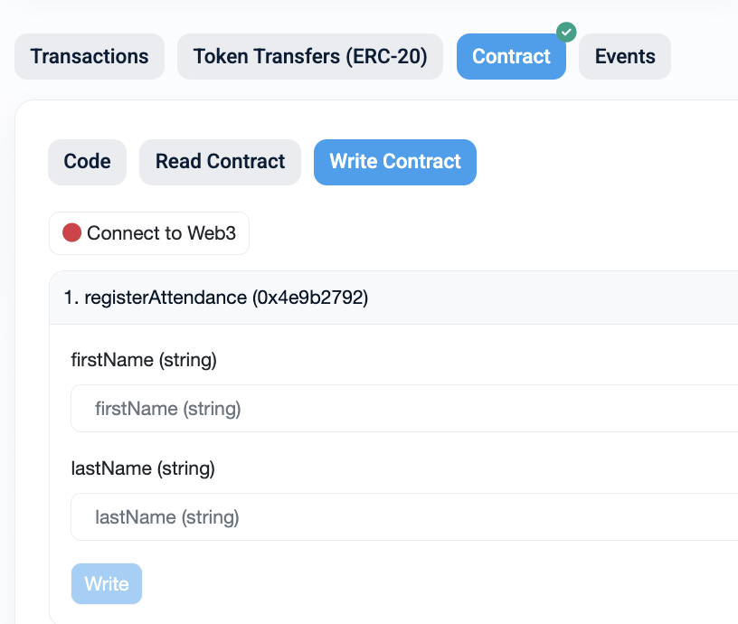
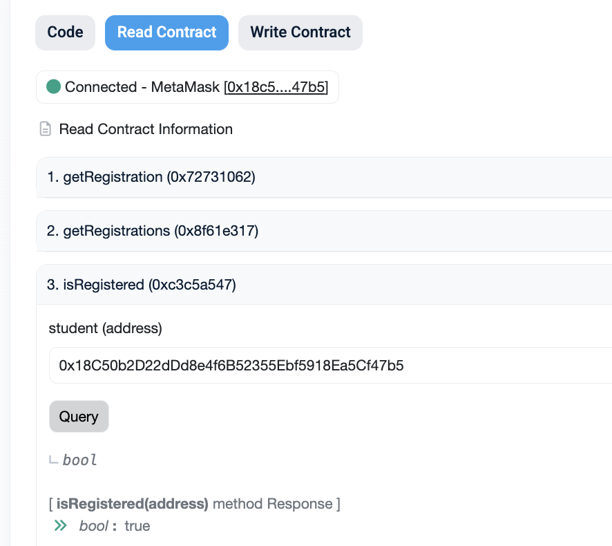

# Tasks

## Attendance (Arbitrum - Ethereum SC bridge interaction) (40p)

**Objective**: You need to register as class attendant with your name and wallet on Ethereum Sepolia. Use your FirstName and the first initial of the LastName.

<!--  -->

### Helpful info
* You need to "Connect to Web3";
* Fill the fields;
* Click on "Write" to submit the transaction;
* Your Metamask extension will pop up to confirm the transaction;
* USDT Token Address: `0x7169D38820dfd117C3FA1f22a697dBA58d90BA06`

### Check your attendance

<!--  -->

* Go to "Read Contract" section;
* You don't need to be connected to wallet to read information from blockchain;
* You can query any information you want, but to check your attendance you should call "isRegistered" function with your wallet address.

### Given addresses
* ⁠ETH Sepolia explorer: https://sepolia.etherscan.io/
* ⁠⁠Arbitrum Sepolia explorer: https://sepolia.arbiscan.io/
* ⁠⁠Onboard SC Address (Sepolia Arbitrum): 0x80a79D9AC9806bc57e11Ff83BD362d1869c766b1
* ⁠⁠Bridge Address: https://bridge.arbitrum.io/?amount=0&destinationChain=sepolia&sourceChain=arbitrum-sepolia&tab=bridge

## Bridge (Ethereum - Arbitrum SC bridge interaction) (10p)

* Bridge tokens from Ethereum to Arbitrum;
* Send them to `0x18C50b2D22dDd8e4f6B52355Ebf5918Ea5Cf47b5` to score points; The amount doesn't matter.

## Create a Token on Arbitrum (10p)

* Create a token on Arbitrum;
* Send them to `0x18C50b2D22dDd8e4f6B52355Ebf5918Ea5Cf47b5` to score points.

## Swap / Exchange tokens (20p)

* Swap Ethereum to USD (USDT/USDC);

## Add Liquidity (30p)

* Use uniswap to add liquidity to any pool;

## Lend / Borrow tokens (30p)

* Lend tokens to Aave;

## Overcollateralized Loan (40p)

* Supply 0.05 WETH to Aave. Note your starting collateral value and Health Factor.
* Borrow 50% of your maximum USDC (keep Health Factor well above 1.5).
* Swap the borrowed USDC for WETH on Uniswap. Record the WETH received.
* Supply this new WETH to Aave again. Note your new Health Factor and total collateral.
* CALCULATE after Loop 1: (a) Total WETH exposure, (b) Total USDC debt, (c) Effective leverage ratio = total exposure / initial capital.
* ANALYSIS: If you ran 3 loops, estimate your leverage ratio. At what ETH price would you face liquidation? Draw the payoff diagram (sketch or describe): how does this compare to buying ETH on margin at a broker?

## DeFiLlama (5p)

1. Open DeFiLlama (defillama.com) → click 'Yields' in the left menu.
2. Filter by stablecoin: search for USDC, DAI, USDT. Sort by APY descending.
3. Inspect the top stablecoin yield opportunities: protocol name, chain, APY, and TVL.
4. Send an email to `costin.carabas@upb.ro` with the top stablecoin yield opportunities you found.

