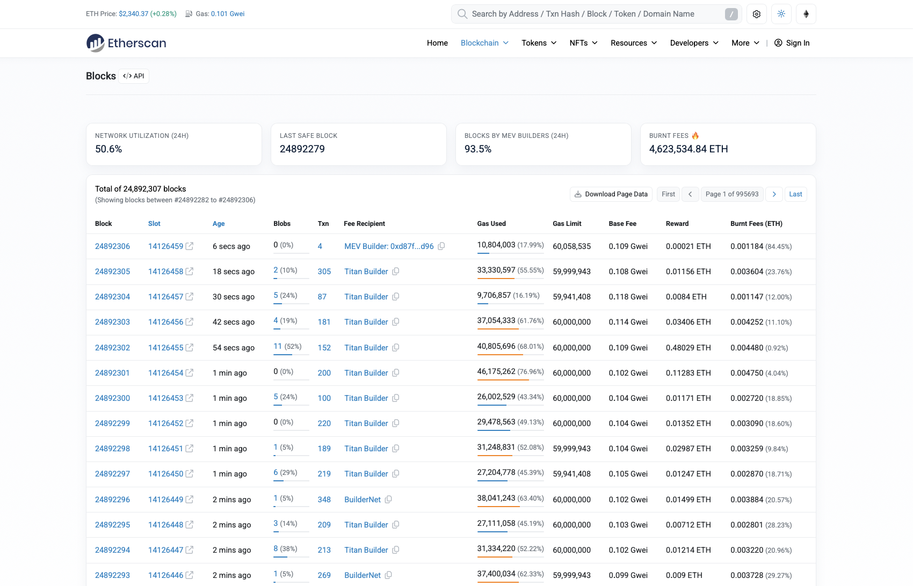

# Blocks in Blockchain

For simplicity, we will use Ethereum blockchain and Ethereum [Explorer](https://etherscan.io/).

## Notarization of blocks

Inspect the image below:

As we can observe, **5 different blocks** have been created over the last minute, with a new block being generated approximately every 12 seconds.

:::note
We previously saw that _every 12 seconds starts new round_, but _not necessarly a new block gets notarized_.

Because of this, transactions initiated within the last minute may remain in the Pending Finalization stage. They must wait to successfully pass the network's consensus mechanism before they can be officially notarized and finalized on the blockchain.
:::

## Block details

[Here](https://etherscan.io/block/24892306) is the link for one of the blocks in the previous image (Block Height: 24892306).

Observe the block details:

- Epoch
- Age (timestamp)
- Transactions
- Withdrawals

Based on a simple calculus, the epoch is 441451 which means this blockchain started 5 years and 136 days ago.

We will talk about the other fields in the next section.

## Practice

1. Go to the Ethereum [Explorer](https://etherscan.io/) and check some blocks details.
2. Go to the Solana [Explorer](https://solscan.io) and check some blocks details.
