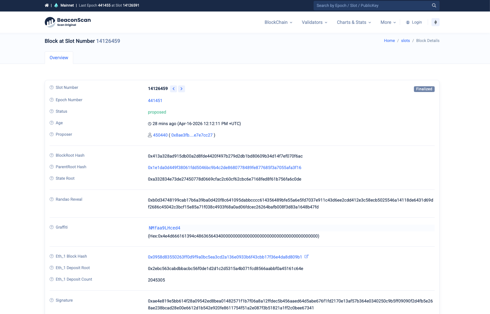

# Consensus Group

We will continue with the same [block](https://etherscan.io/block/24892306) from the previous section (Block Height: 24892306).

Observe the field **Consensus Group**:

There are 63 validators which execute every transaction in this block.
If you click on the **63 validators (See all)** button you will see 63 public keys, which are links to all the 63 nodes that participated in consensus.

## Practice

- Open 3 different blocks in 3 different tabs. Observe that every time there is another consensus group.
Why do you think the system is designed this way?
- Open 3 different blocks in 3 different tabs on Ethereum [Explorer](https://etherscan.io/). Observe that every time there is another leader.
