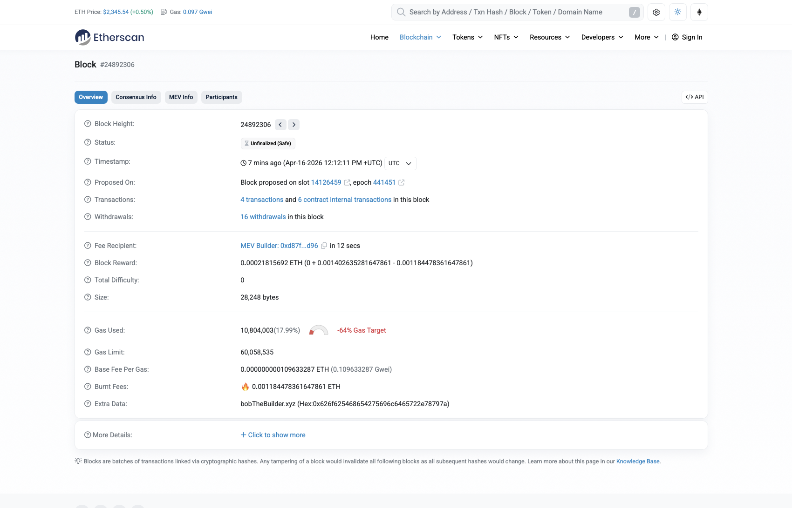
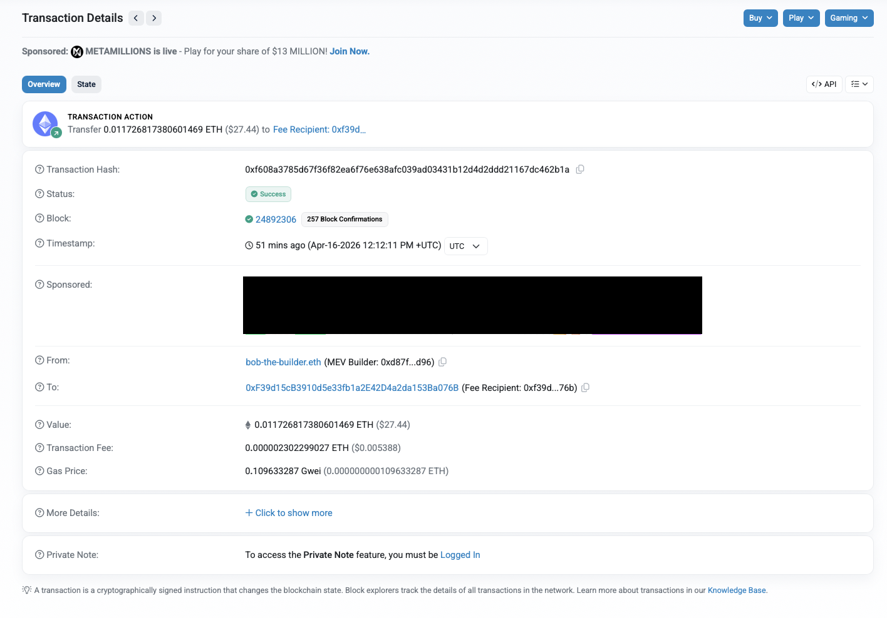

# Transactions

We will continue with the same [block](https://etherscan.io/block/24892306) from the previous section (Block Height: 24892306).

Observe the field **Transactions**:

We can see that there are 4 transactions and 6 smart contract transactions in this group.

## Transaction details

We will check the first [transaction](https://etherscan.io/tx/0xf608a3785d67f36f82ea6f76e638afc039ad03431b12d4d2ddd21167dc462b1a):

Observe the fields:

- Status: Success;
- Timestamp;
- From: The user who created the transaction
- To: The destination of the transaction.
- Value: The number of Ether (Ethereum native token) sent in this transaction

There are more fields in this transaction, but we will discuss about it in a further section.

## Practice

- Open 3 different transactions in 3 different tabs on Ethereum [Explorer](https://etherscan.io/). Inspect the fields.
- Open 3 different transactions in 3 different tabs on Bitcoin [Explorer](https://www.blockchain.com/explorer/mempool/btc). Inspect the fields.
