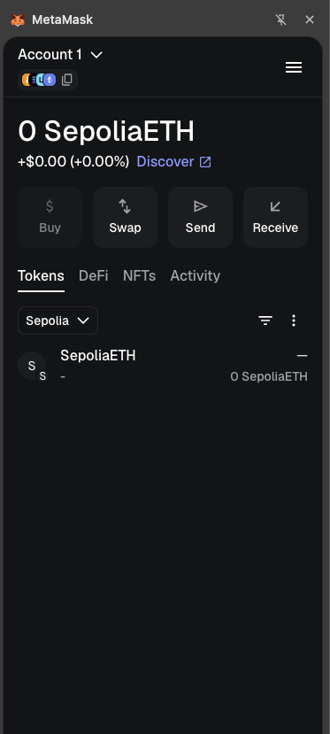
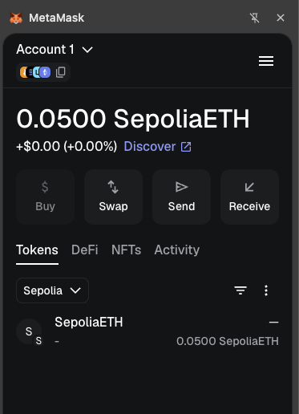

# Installing MetaMask

## Connecting to Networks

For the workshop, we'll need to connect to various networks:

### Ethereum Testnets

1. Click the menu in the top-right corner and select `Networks`
2. Scroll down and toggle *Show test networks* at the bottom of the network list
3. To keep a specific testnet (like Sepolia) easily accessible, click the 3 vertical dots next to the network's name, select *Edit*, and then click *Save*.

For more detailed instructions, you can access the [How to view testnets in MetaMask](https://support.metamask.io/configure/networks/how-to-view-testnets-in-metamask/).

After you've completed these steps, your wallet should look like the example below:

### Adding Other Networks

For Arbitrum or Base networks:

1. Click the menu in the top-right corner and select `Networks`
2. Choose from popular networks.

Let's add Arbitrum and Base. If you click on Edit, you will see its charactheristics.

For Arbitrum Network you will see:

- Network Name: Arbitrum
- RPC URL: <https://arb1.arbitrum.io/rpc>
- Chain ID: 42161
- Currency Symbol: ETH
- Block Explorer URL: <https://arbiscan.io>

For Base Network you will see:

- Network Name: Base
- RPC URL: <https://base-mainnet.infura.io>
- Chain ID: 8453
- Currency Symbol: ETH
- Block Explorer URL: <https://basescan.org>

You can also add a custom network by clicking "Add a custom network" button at the bottom center. Let's add manually the next networks with the following details:

#### Arbitrum Sepolia (Testnet)

- Network Name: Arbitrum Sepolia
- RPC URL: <https://sepolia-rollup.arbitrum.io/rpc>
- Chain ID: 421614
- Currency Symbol: ETH
- Block Explorer URL: <https://sepolia.arbiscan.io/>

#### Base Sepolia (Testnet)

- Network Name: Base Sepolia
- RPC URL: <https://sepolia.base.org>
- Chain ID: 84532
- Currency Symbol: ETH
- Block Explorer URL: <https://sepolia.basescan.org>

## Getting Test Funds

A faucet is an application that dispenses free tokens on a testnet. These tokens allow you to experiment with the testnet.

Many testnet environments require your wallet address to hold some real funds on the Mainnet before you can use their faucets. However, by using the [Google Cloud Web3 Faucet](https://cloud.google.com/application/web3/faucet), you can bypass this requirement and claim test tokens even with an empty wallet.

:::note
Not all testnet networks are integreated in the *Google Cloud Web3 Faucet* service.
:::

:::info
The faucet functionality is limited to one use per network, per Google account, every 24 hours. If you claim tokens and then try to use the same Google account to fund a different wallet address within that 24-hour window, it will not work.
:::

For workshop exercises, you'll need test ETH for Sepolia:

1. Navigate to the [Google Cloud Web3 Faucet](https://cloud.google.com/application/web3/faucet) portal.
2. Select the network: Ethereum Sepolia.
3. Enter your Ethereum wallet address from MetaMask (the string of characters copied from your wallet that starts with `0x...`).
4. Complete the process to request the funds.

To verify the transaction, click the Transaction Hash [link](https://sepolia.etherscan.io). You will be redirected to the single transfer transaction showing an amount of 0.05 ETH.

Now, Metamask will have the next output:

## Security Best Practices

- Never share your seed phrase or private keys
- Consider using a hardware wallet for significant funds
- Always verify website URLs before connecting your wallet
- Review all transaction details before signing
- Disconnect your wallet from websites when not in use
- Keep your browser and MetaMask extension updated

## Troubleshooting

Common issues and solutions:

1. **Transaction Stuck Pending**
   - Click on the pending transaction
   - Select "Speed Up" (increases gas fee) or "Cancel"

2. **Can't Connect to a Website**
   - Ensure the website is legitimate
   - Try refreshing the page
   - Disconnect and reconnect MetaMask

3. **Network Connection Issues**
   - Switch to a different network and back
   - Check your internet connection
   - Try a different RPC URL for the network

## Next Steps
<!-- 
Now that you have MetaMask installed and configured:

- Try sending a small amount of test ETH between accounts
- Explore block explorers to track your transactions
- Connect to a simple dApp to understand the connection process -->

In the next section of the workshop, we'll use MetaMask to send a small amount of test ETH between accounts

## Resources

- [MetaMask Official Documentation](https://support.metamask.io)
- [Ethereum Developer Documentation](https://ethereum.org/developers)
- [Workshop Repository](https://github.com/cs-pub-ro/workshop-blockchain-protocols-and-distributed-applications)
