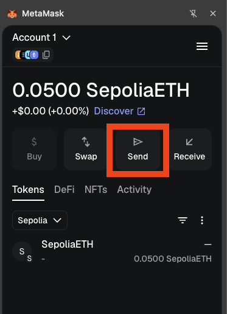
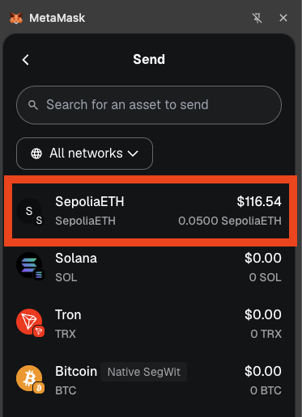
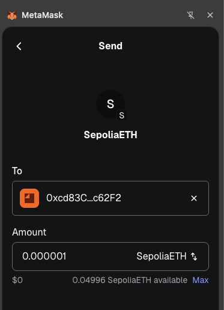
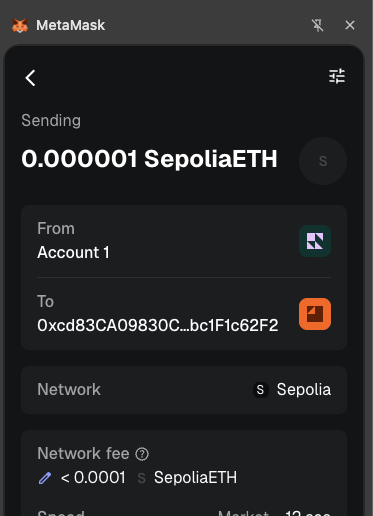
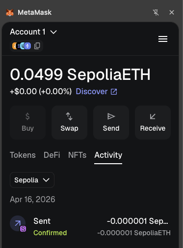

# Sending Test ETH Between Accounts

Follow these steps to practice sending your test SepoliaETH to another wallet:

1. **Initiate the Transfer**: Open the MetaMask extension, ensure you are on the account you want to send funds from, and click the `Send` button.

    

2. **Select the Asset**: Choose *SepoliaETH* to ensure you are sending test tokens on the Sepolia network.

    

3. **Enter the Destination**: Input the public wallet address of your recipient (this should start with `0x...`).

4. **Specify the Amount**: Enter the exact amount of test tokens you wish to send, then click Next.

    

5. **Review and Confirm**: You will see the estimated network fees (gas fees) required for your transaction. Always double-check the recipient's address for accuracy, then click Confirm to authorize the transfer.

    

6. **Track Your Activity**: You will be returned to the main screen. Click the Activity tab to view your recent transactions and monitor the status of your transfer.

    

<!-- - Connect to a simple dApp to understand the connection process -->

## Resources

- [MetaMask Official Documentation](https://support.metamask.io)
- [How to send tokens from your MetaMask wallet](https://support.metamask.io/manage-crypto/move-crypto/send/how-to-send-tokens-from-your-metamask-wallet/)
- [Ethereum Developer Documentation](https://ethereum.org/developers)
- [Workshop Repository](https://github.com/cs-pub-ro/workshop-blockchain-protocols-and-distributed-applications)
- [Testnet Sepolia](https://sepolia.etherscan.io)
