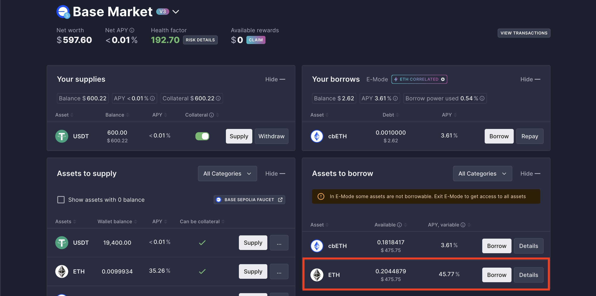
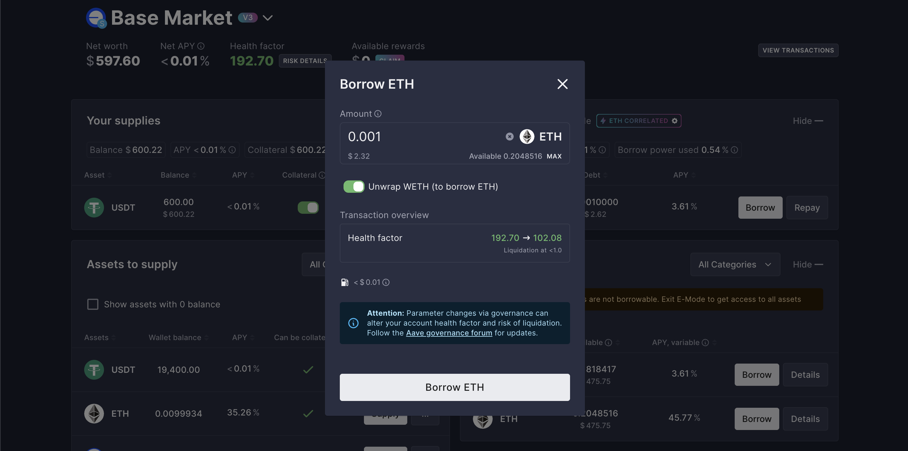
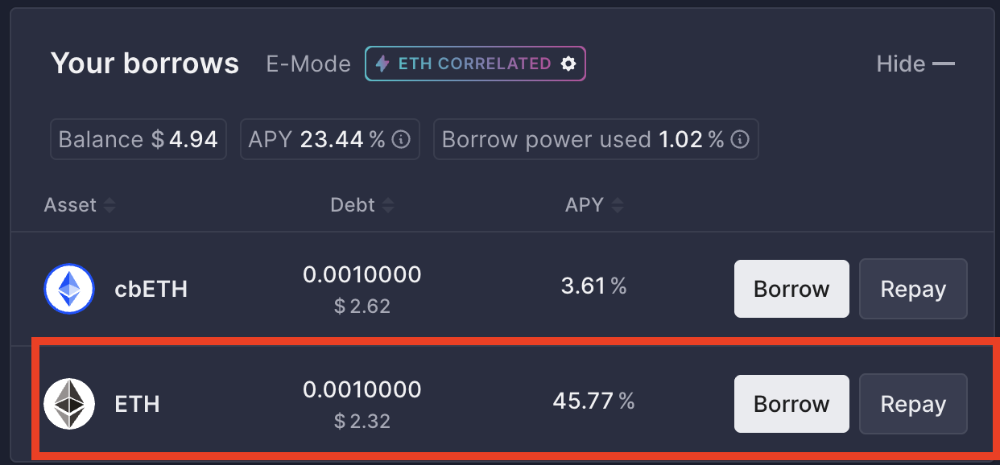

# Borrowing Assets

## Verify Your Collateral is Enabled

1. On your Aave **Dashboard**, look at the **Your supplies** section at the top left.
2. Find the asset you just deposited.
3. Look at the **Collateral** column next to it. Ensure the toggle switch is turned **ON**.

## Choose an Asset to Borrow

1. Stay on the **Dashboard** and scroll down to the right side of the screen where it says **Assets to borrow**.
2. This list shows all the tokens available to borrow, along with the current APY (the interest rate you will have to pay for the loan).
3. Find the asset you want to borrow and click the **Borrow** button next to it. For this tutorial, we will choose ETH.

    

## Execute the Borrow Transaction

1. A new window will pop up asking how much you want to borrow.
2. Enter the amount. For now, we will borrow 0.001 ETH. You will notice the interface won't let you borrow 100% of your collateral's value—this is because Aave requires your loan to be **over-collateralized** to protect the protocol.
    
3. Keep an eye on the **Health Factor** meter at the bottom of the window:
   * **Green/Safe:** You are at a low risk of liquidation.
   * **Red/Risky:** You are borrowing too close to your maximum limit.
4. Once you are happy with the amount and your Health Factor is in a safe range, click **Borrow**.
5. Confirm the transaction in your web3 wallet.

## Monitor Your Loan

1. Once the transaction confirms, the borrowed tokens will instantly appear in your wallet, ready to be used!
2. On your Aave dashboard, you will now see a **Your borrows** section at the top right. This tracks your current debt and the interest accruing against you.
    

:::tip
Crucial Rule of DeFi Borrowing:** Always watch your **Health Factor**. If the value of your supplied collateral drops, or the interest on your borrowed assets grows too high, your Health Factor will decrease. If it drops below **1.00**, your collateral will be automatically liquidated (sold off by the smart contract) to repay your debt.
:::
