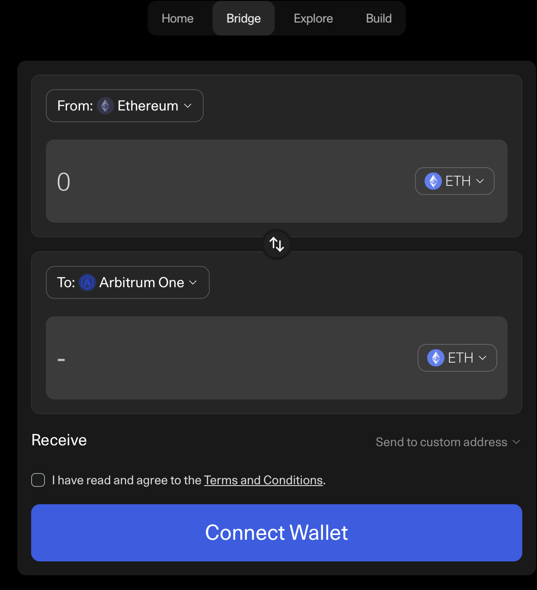
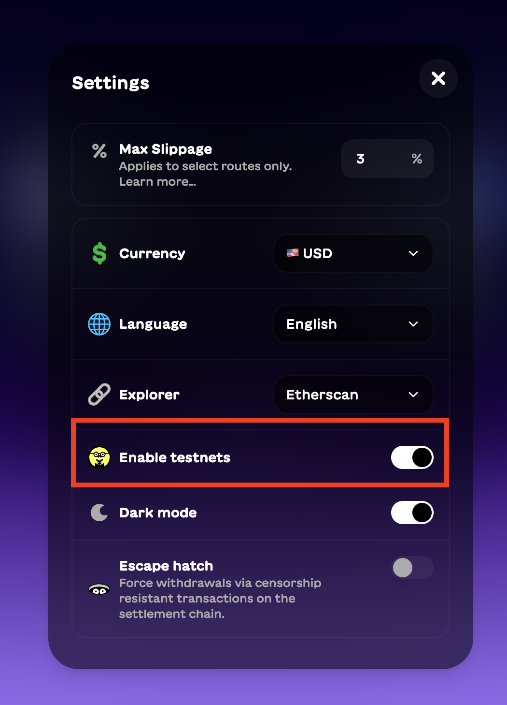
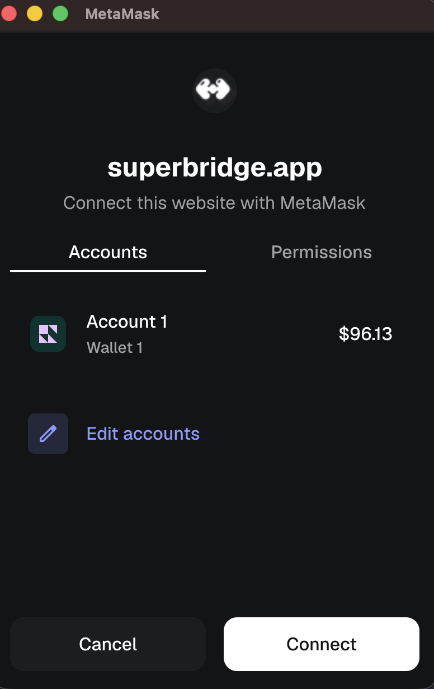
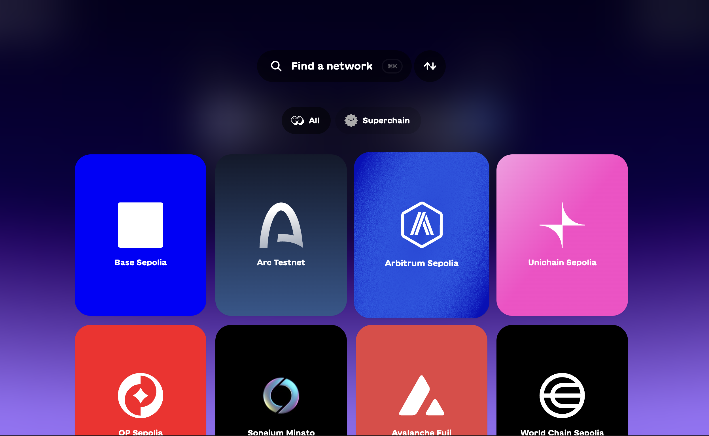
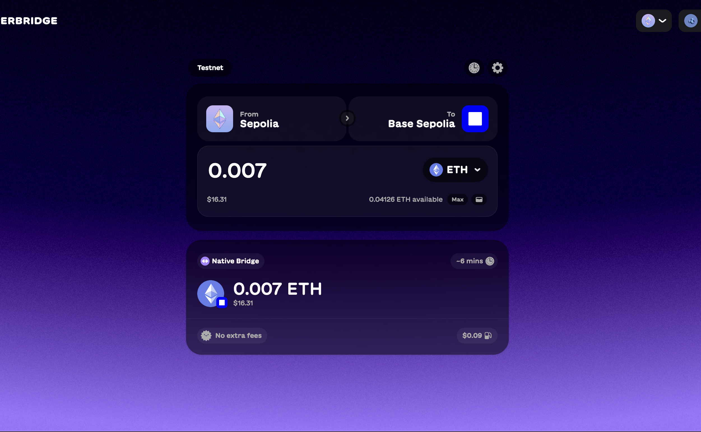
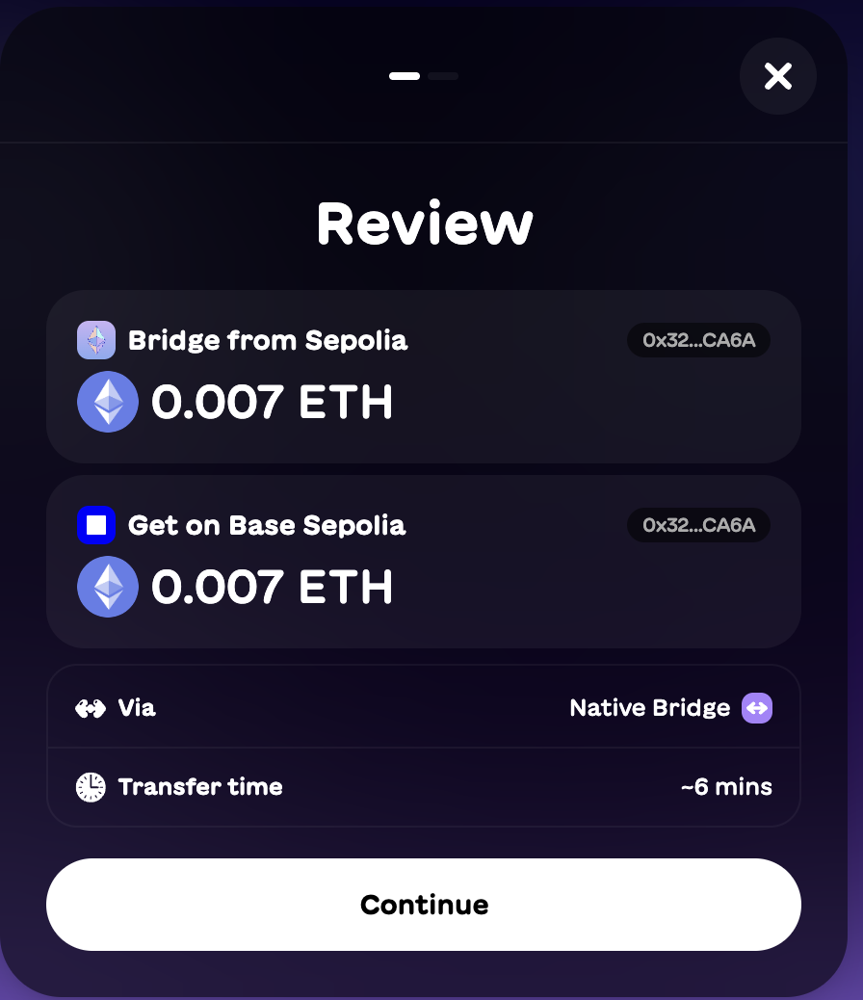
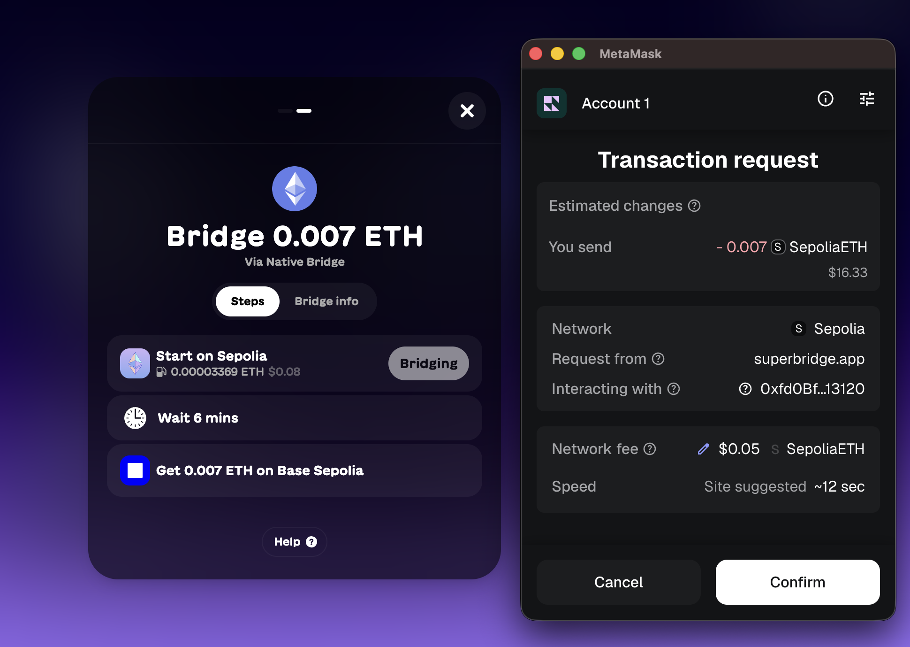

# Using a Bridge

## Arbitrum Bridge

Here is the [Arbitrum Bridge](https://portal.arbitrum.io/bridge).
<!--  -->

## Superbridge

We will transfer funds from the Ethereum Sepolia network to Base Sepolia using [Superbridge](https://superbridge.app).

Access the application's settings and toggle on the option to activate testnets.

Click the connect button in the top right corner of the screen and select the MetaMask option.

You will be prompted by your MetaMask extension. Click Connect to link your wallet to Superbridge.

In the bridging interface, choose to move funds from Ethereum Sepolia to Base Sepolia.

Input the amount of tokens you want to transfer. Now, we will move 0.007 ETH.

Select the option to transfer via the Native Bridge.

You will be shown the transaction details and estimated network costs. Review this information, and if everything is correct, click the button to start the transaction.

You will be redirected to your MetaMask wallet one final time. Review the prompt and click Confirm to execute the transaction.

