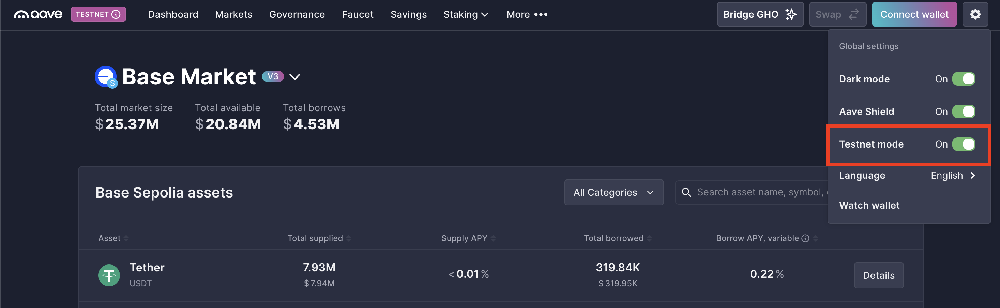
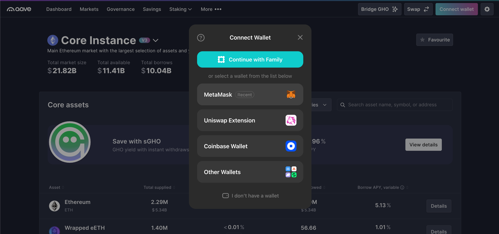
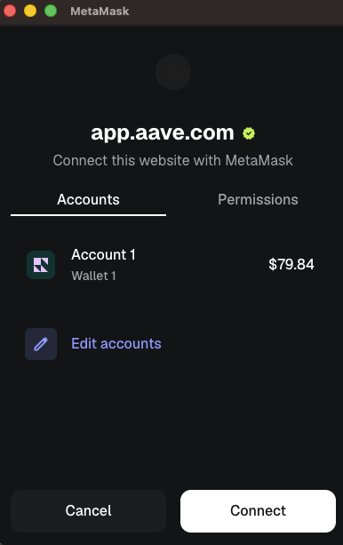
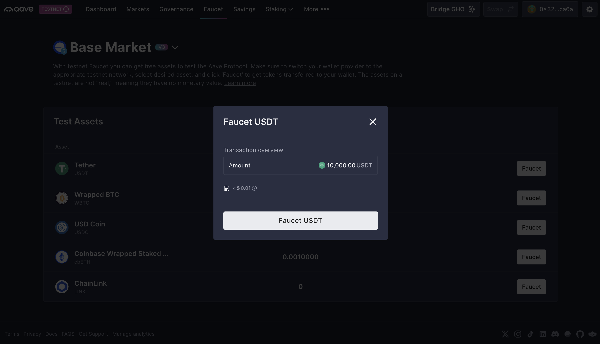
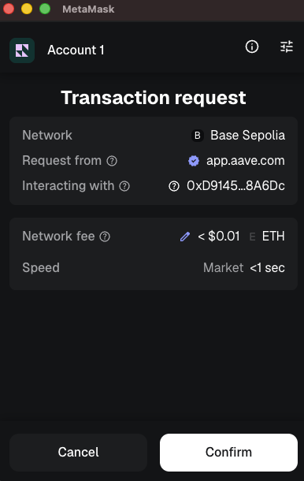
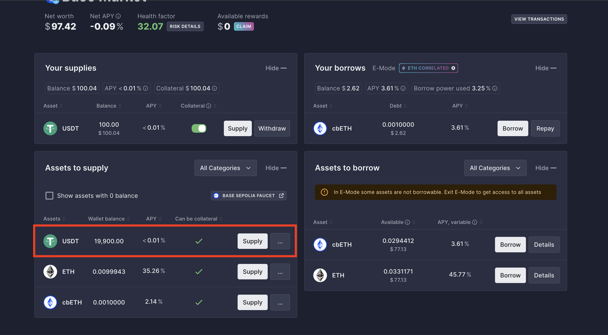
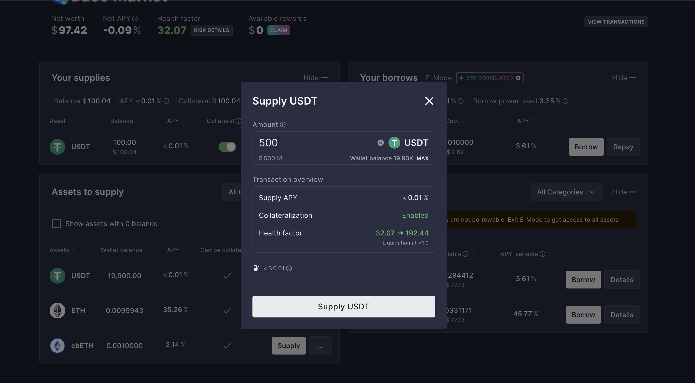

# Lending Assets

We will supply (lend) funds on a decentralized lending protocol to earn interest, using the Base test network.

## Access the Platform & Enable Testnets

1. Navigate to the decentralized lending platform (e.g., [app.aave.com](https://app.aave.com/)).
2. Access the application's settings and toggle on **Testnet mode**.

    

## Connect Your Wallet

1. Click the **Connect Wallet** button in the top right corner of the screen.
2. Select the **MetaMask** option from the list of available wallets.
    
3. Your MetaMask extension will pop up. Select your account and click **Connect**.
    

## Get Test Assets

1. Claim Test Assets: Look at the top navigation menu on the Aave dashboard and click Faucet. Choose the asset you want to lend. In our case it will be **Tether**.
    
2. Confirm in Wallet: You will be redirected to your MetaMask wallet to confirm the transaction.
    

## Supply (Lend) an Asset

1. Scroll down to the **Assets to supply** list and locate the token you want to lend. For this tutorial, we will choose USDT.
    
2. Click the **Supply** button next to your chosen asset.
3. Enter the amount of tokens you wish to lend. Now we will lend 500 USDT.
4. Review the estimated APY (Annual Percentage Yield) and transaction details, then click **Supply USDT**.
    

## Confirm the Transaction

1. You will be redirected to your MetaMask wallet.
2. Review the estimated gas fees.
3. Click **Confirm** to execute the transaction.
4. Once the transaction is confirmed on the blockchain, your supplied assets will appear in the **Your supplies** dashboard, and you will begin accruing testnet interest!
