# Swap tokens via Uniswap

In this section, you will learn how to swap a token with another on Ethereum based blockchains. For this, we will use [Uniswap](https://app.uniswap.org).

## Access Uniswap

Navigate to the official [Uniswap web interface](https://app.uniswap.org). Always double check the URL to avoid phising scams.

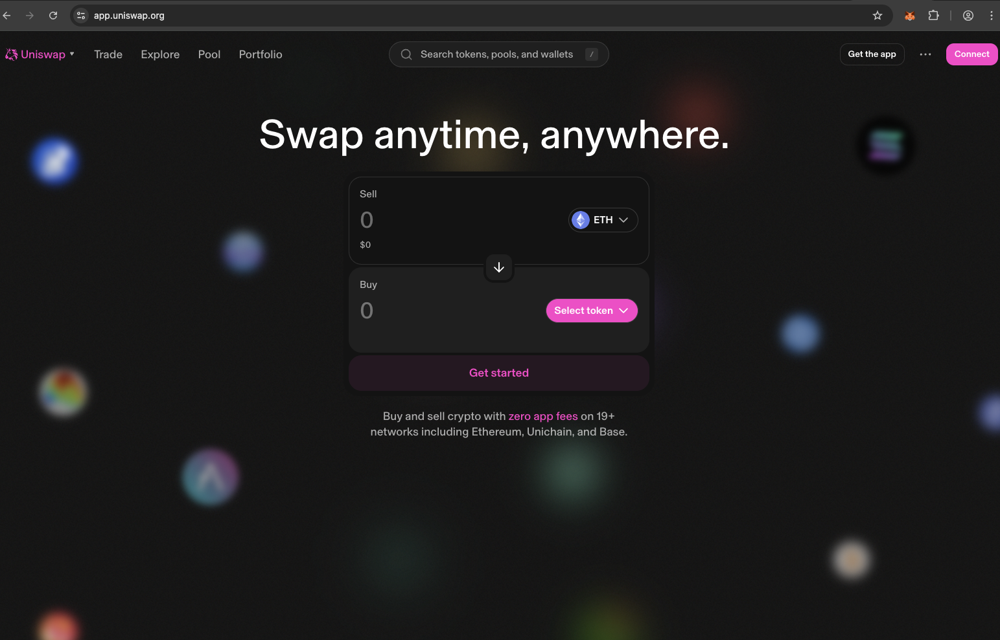

## Download the Uniswap Extension

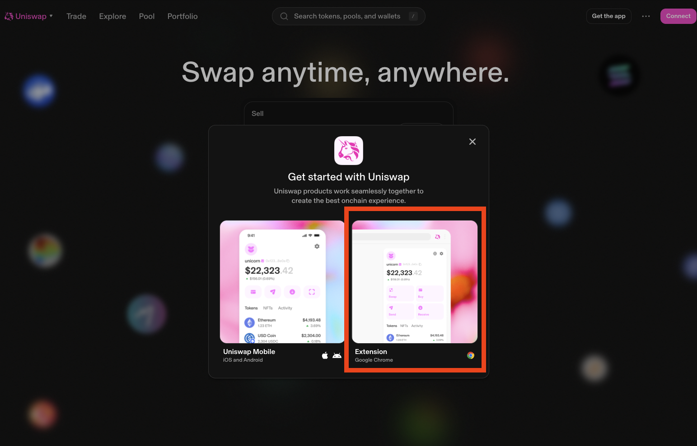

## Connect Uniswap to a Wallet

After the extension is successfully downloaded, you will automatically be redirected to the Uniswap wallet setup page. Here, you will choose whether to create a new wallet or connect an existing one.

In our case, choose the option **"I already have a wallet"** to connect to the wallet you created in your previous MetaMask session.

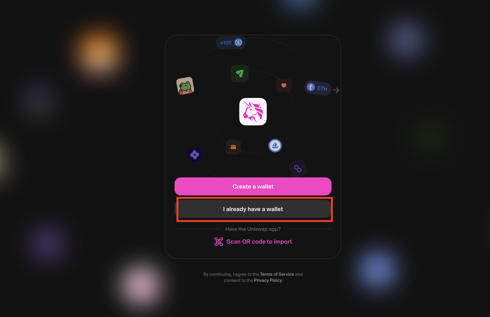

You will be prompted to introduce all the words from your wallet's seed phrase (Secret Recovery Phrase). It is highly important that you enter the words in the exact correct order, with proper spelling and spacing.

After successfully entering the seed phrase, you will create a password. This password is specifically aimed at unlocking the Uniswap extension to access your wallet data on your current device.

Finally, you can choose the specific wallet accounts you want to import and make active.

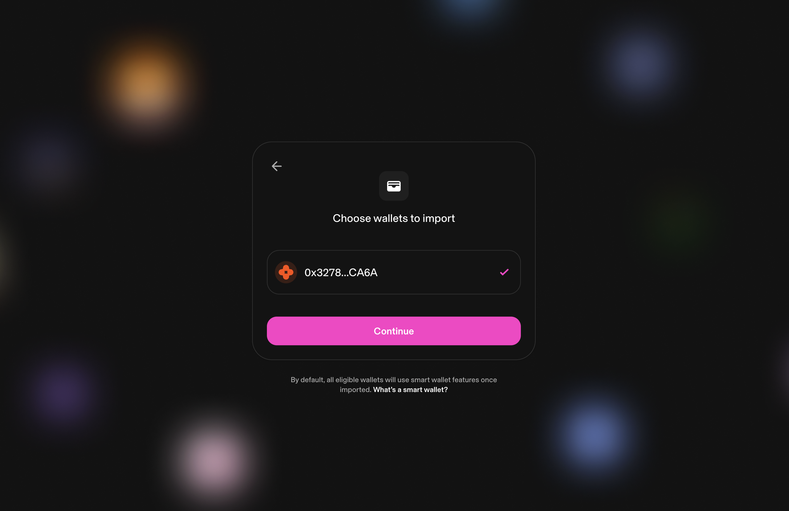

All set! Your wallet is now imported into the Uniswap extension and ready to use.

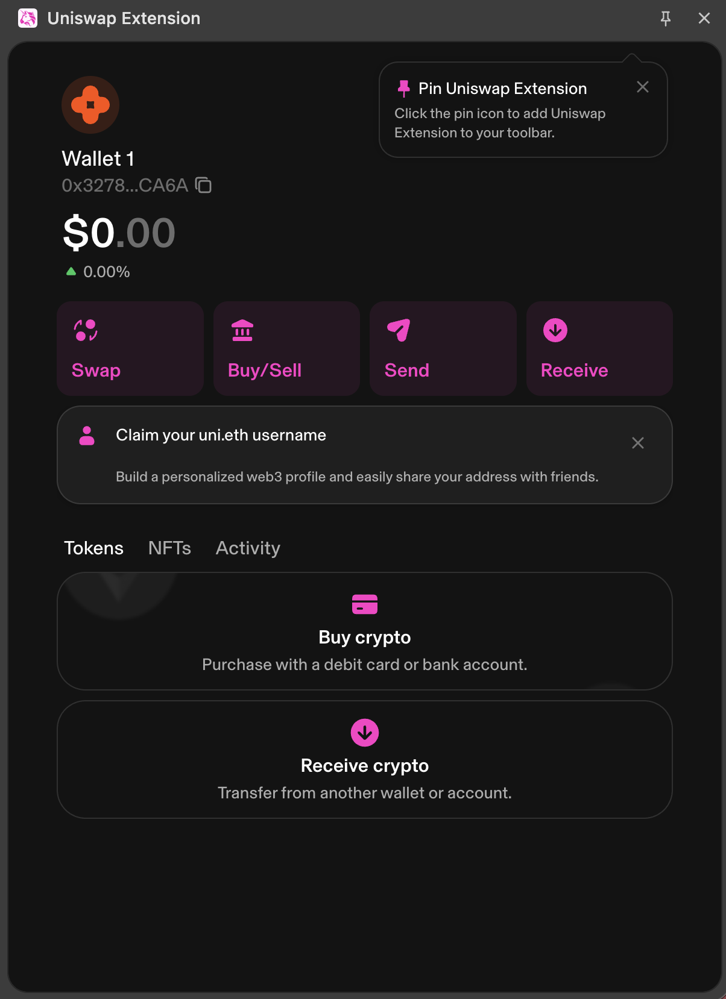

## Enable Test Network & Access Sepolia

To practice swapping without using real money, you need to enable Testnet mode.

1. In the top right corner, press the Settings icon.
2. Navigate to Advanced settings.
3. **Toggle on** Testnet Mode.
    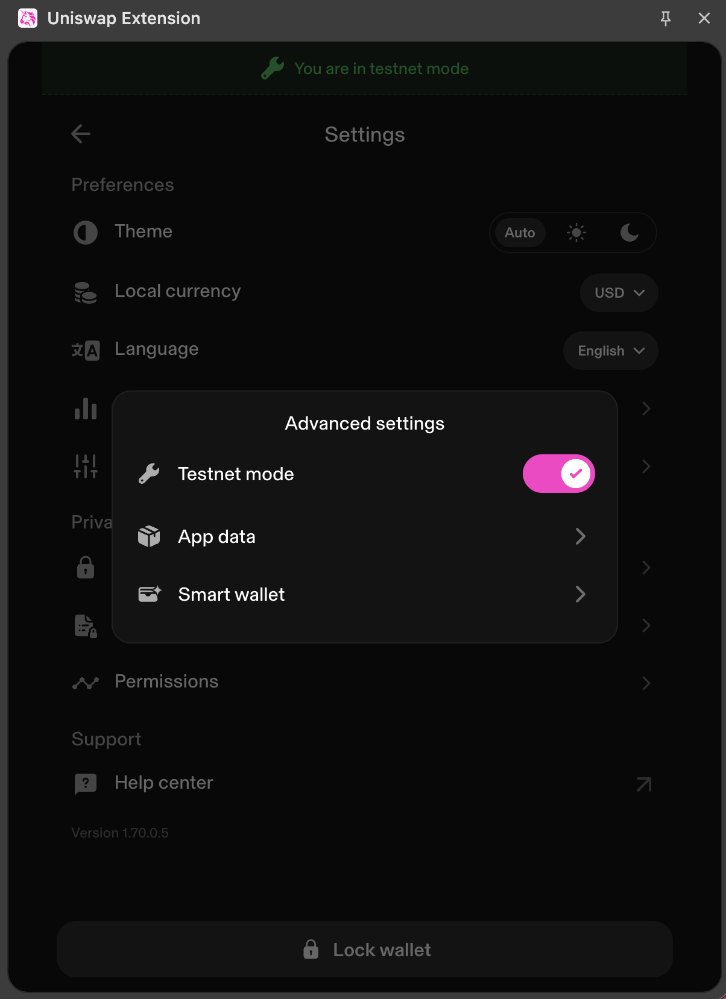
4. While the testnet mode is activated, a message will appear in the upper part of the application informing you that you are currently in testnet mode.
    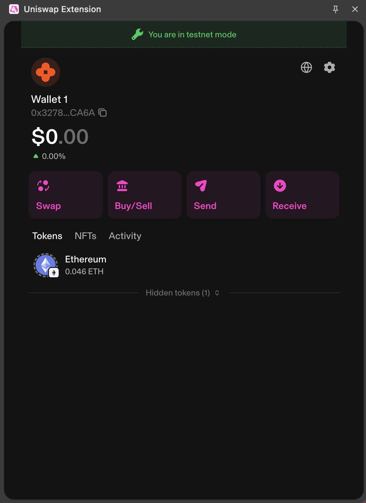

:::info
If you want to operate with **real assets** in the future, you must disable the testnet mode. To do this, go to the top right corner, press Settings, select Advanced settings, and toggle off Testnet Mode.
:::

## [Optional] Faucet

Before you can swap tokens, your wallet needs a balance of ETH to cover the network fees. Google Cloud provides a reliable faucet that drips testnet tokens to developers. More details are available [here](../../../introduction/lab/content/wallet/metamask_config_networks.md#getting-test-funds).

## Swap

Press Swap.

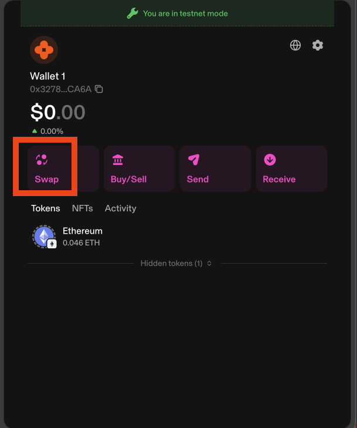

If you press on the token type in the top box (the token you are selling), you can select which asset to use. In our case, we will choose **ETH**.

Choosing the proper network is very important. To change the network, in the right corner of the search tokens bar, there is a drop-down menu where you can select a testnet. For now, Uniswap supports two testnet networks: **Sepolia** and **Unichain Sepolia**. For this demo, we will select Sepolia.

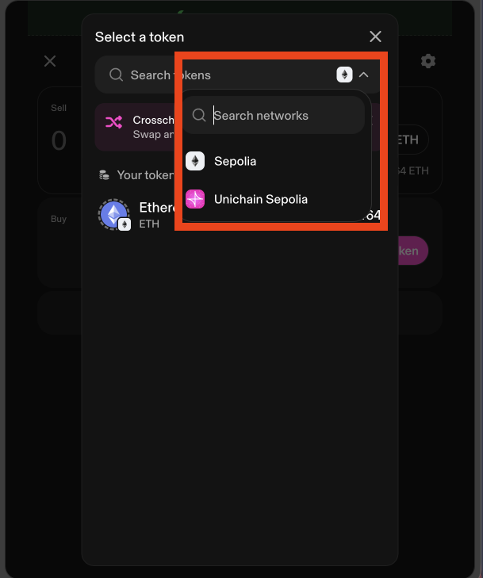

We will buy Wrapped Ether (WETH). In "Buy" box, click to select a token and paste this exact address into the search bar: `0x7b79995e5f793A07Bc00c21412e50Ecae098E7f9`. This is the smart contract address for the WETH token on Sepolia.

:::note
If you want to practice buying other testnet tokens later, you can find their contract addresses [here](https://sepolia.etherscan.io/tokentxns>).
:::

Enter `0.005` in the ETH box. You will see that with `0.005` ETH, we can buy roughly `~0.13` WETH.

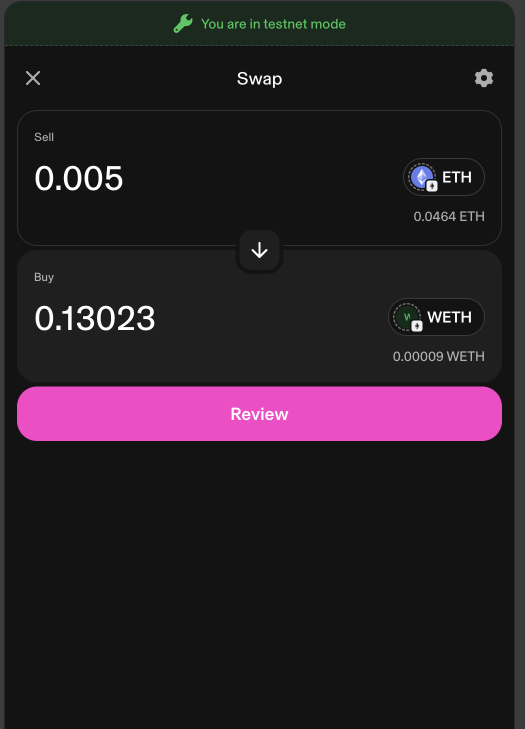

Press the Review button, and the interface will generate some cost estimations for the transaction.

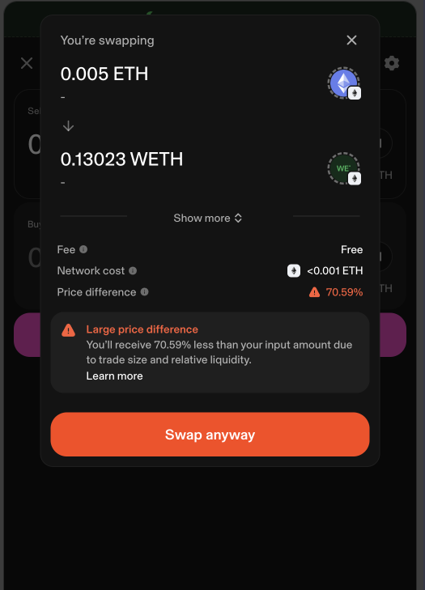

You will likely get a warning about a *"large price difference"*. Because we are in a **safe testing environment** using fake assets, we will press Swap anyway.

Once the transaction confirms, your newly bought tokens will be available in your wallet's Tokens tab. If you can't see them immediately, check the Hidden tokens section.

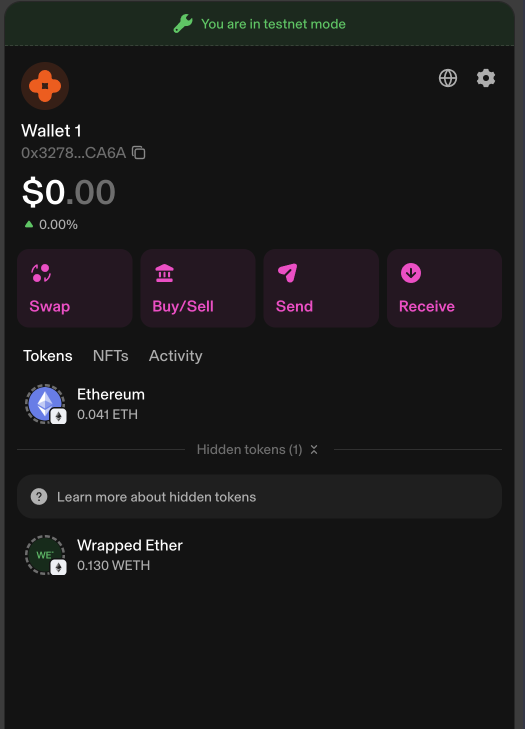

## Task

:::info
`0x32783503F277930fD1f9C225285db5F5dB86CA6A`
:::
