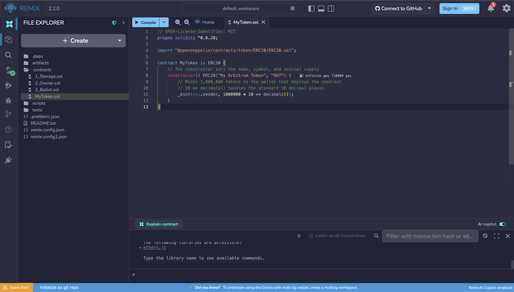
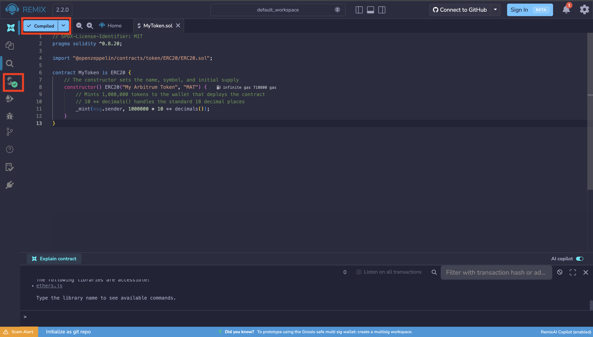
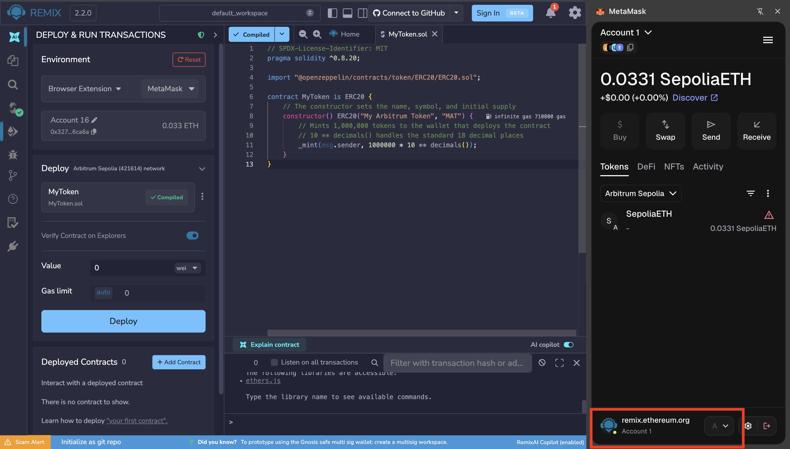
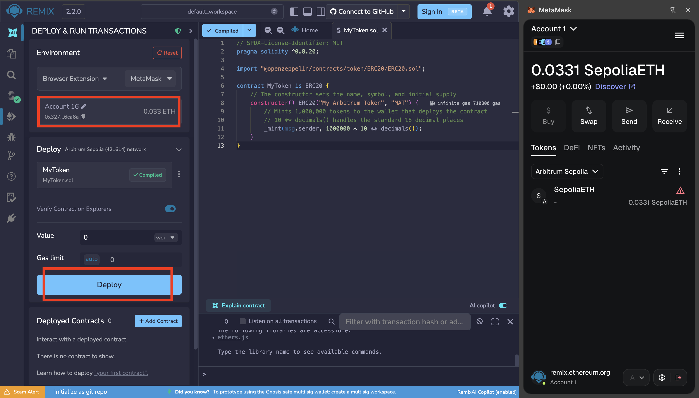
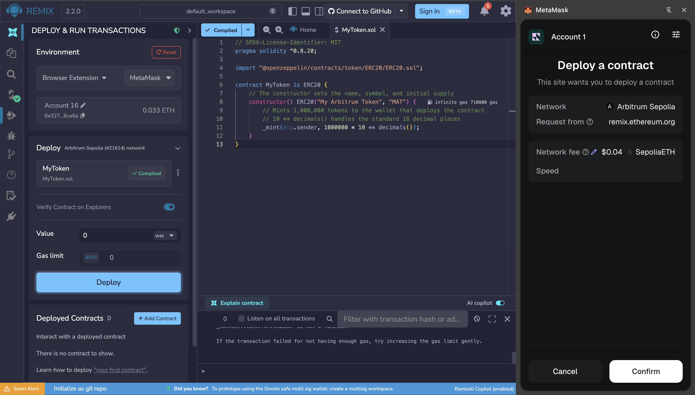
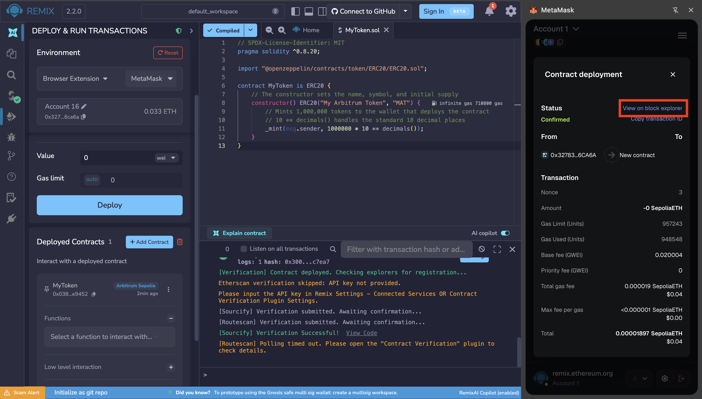
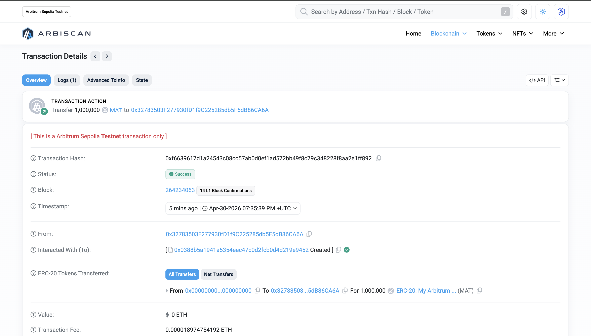
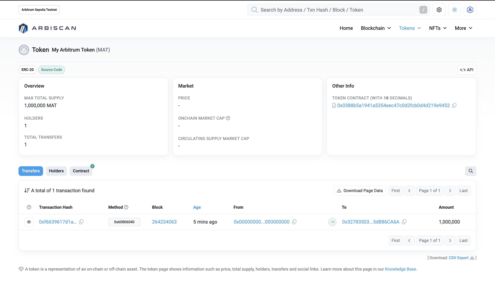

# Mint tokens on Ethereum Testnet based chains (EVM-based)

Creating a token on testnet is an excellent way to practice deploying smart contracts. You can experience fast transaction speeds and low fees without spending real money.

In this tutorial, we will use the industry-standard OpenZeppelin library and the browser-based [Remix IDE](https://remix.live) to make the deployment process as straightforward as possible. We will issue tokens on **Arbitrum Sepolia**, but the process is the same for any Ethereum-based chain.

## Write the Smart Contract

[Remix IDE](remix.ethereum.org) is a tool that runs the entire Ethereum ecosystem in the web browser.

In the **"File Explorer"** panel on the left, create a new file by clicking **"Create"**. Name the file `MyToken.sol`. The new file must be in the `contracts` directory.

Copy and paste the standard ERC-20 token code below. This code imports the highly secure OpenZeppelin standard.



```sol
// SPDX-License-Identifier: MIT
pragma solidity ^0.8.20;

import "@openzeppelin/contracts/token/ERC20/ERC20.sol";

contract MyToken is ERC20 {
    // The constructor sets the name, symbol, and initial supply
    constructor() ERC20(#PLACEHOLDER1, #PLACEHOLDER2) {
        // Mints #PLACEHOLDER3 tokens to the wallet that deploys the contract
        // 10 ** decimals() handles the standard 18 decimal places
        _mint(msg.sender, #PLACEHOLDER3 * 10 ** decimals());
    }
}
```

* `#PLACEHOLDER1` is the **Token Name**. This is the full, descriptive name of your cryptocurrency. It must be formatted as a string, meaning you need to enclose it in quotation marks.
* `#PLACEHOLDER2` is the **Token Symbol**. This is the short, memorable ticker symbol that wallets and exchanges will use to display your token (like BTC or ETH). It must also be a string enclosed in quotation marks.
* `#PLACEHOLDER3` is the **Initial Supply**. This is the total number of whole tokens you want to create and send to your wallet immediately when the contract is deployed. It must be written without quotation marks.

## Compile the Smart Contract

Click the **Compile** icon.

Look for a green checkmark to appear, indicating the code compiled successfully.



## Deploy the Smart Contract

Click the **Deploy & run transactions** icon on the far left menu.

Under the **Environment** dropdown menu, select **Browser Extension**, then select **MetaMask**.

In MetaMask, ensure the selected network is Arbitrum Sepolia. It is important to have this environment correctly configured, as this is where we will issue our tokens.



Verify that your account has an ETH balance. Otherwise, [retrieve tokens](../../../introduction/lab/content/wallet/metamask_config_networks.md#getting-test-funds).

Click the **Deploy** button.



MetaMask will pop up, asking you to confirm the transaction and pay the gas fee. Click Confirm.



## View Your Token on the Explorer

Once the transaction confirms, your token is officially live on the Arbitrum Sepolia testnet.

To view your token's information on the block explorer, open MetaMask and ensure you are still connected to the network where you created the tokens (Arbitrum Sepolia).

Navigate to the **Activity** tab and click on the most recent transaction, which represents your contract deployment. From there, select **View on block explorer** to open the transaction details directly in Arbiscan.



For reference, you can check out the [contract creation transaction](https://sepolia.arbiscan.io/tx/0xf6639617d1a24543c08cc57ab0d0ef1ad572bb49f8c79c348228f8aa2e1ff892) and the resulting [token](https://sepolia.arbiscan.io/token/0x0388b5a1941a5354eec47c0d2fcb0d4d219e9452) from this tutorial.




